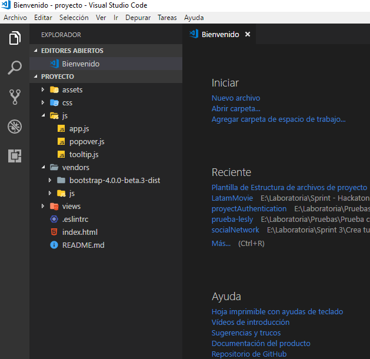

# Plantilla de Estructura para proyectos

## Carpetas
  - assets que contiene 2 carpetas:
    * docs: contiene archivos incluídos en README.
    * images: contiene imágenes incluídas en el proyecto.

  - css que contiene un archivo principal:
    * main.css
    * archivos adicionales de estilos

  - js que contiene un archivo principal: 
    * app.js
    * archivos adicionales de funcionalidad

  - vendors que contiene 2 carpetas: 
    1. bootstrap o el framework a utilizar
    2. js y esta a su vez contiene un archivo jquery.
    
  - views esta carpeta contiene archivos index adicionales.

## Archivos 
1. .eslintrc: corrige sintaxis.
1. index.html: archivo principal.
2. README.md: archivo con descripción del proyecto realizado.

### Aquí la muestra de la estructura del proyecto
